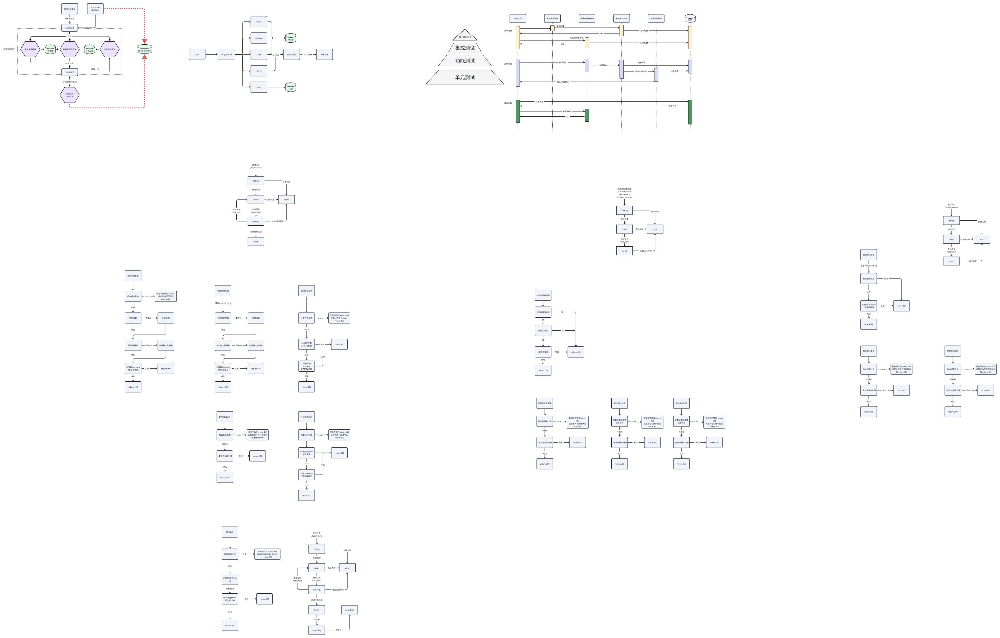

# BINGO

本项目是zrpc跨语言的demo实验，希望结合go-zero脚手架的优异特性和python在深度学习应用中的丰富社区。我们在这个项目中使用api调用zrpc-client，然后使用grpc实现跨语言的调用，python实现的grpc客户端可以实现模型训练和推理。由于这可能将是我们后续的只是开始或者基石，所以我命名其为bingo,寓意begin + go = bingo.  

<!-- PROJECT SHIELDS -->

[![Contributors][contributors-shield]][contributors-url]
[![Forks][forks-shield]][forks-url]
[![Stargazers][stars-shield]][stars-url]
[![Issues][issues-shield]][issues-url]
[![MIT License][license-shield]][license-url]
[![LinkedIn][linkedin-shield]][linkedin-url]

<!-- PROJECT LOGO -->
<br />

<p align="center">
  <a href="https://github.com/kongfuguagua/BINGO/blob/main/BINGO.png">
    
  </a>

  <h3 align="center">BINGO</h3>
  <p align="center">
    安眼测试系统架构
    <br />
    <a href="https://github.com/kongfuguagua/BINGO"><strong>探索本项目的文档 »</strong></a>
    <br />
    <br />
    <a href="https://github.com/kongfuguagua/BINGO">查看Demo</a>
    ·
    <a href="https://github.com/kongfuguagua/BINGO/issues">报告Bug</a>
    ·
    <a href="https://github.com/kongfuguagua/BINGO/issues">提出新特性</a>
  </p>

</p>


 本篇README.md面向安眼系统测试系统自定义组件开发者
 
## 目录

- [上手指南](#上手指南)
  - [开发前的配置要求](#开发前的配置要求)
  - [安装步骤](#安装步骤)
- [文件目录说明](#文件目录说明)
- [Demo](#Demo)
- [使用到的框架](#使用到的框架)
- [版本控制](#版本控制)
- [作者](#作者)
- [鸣谢](#鸣谢)

### 上手指南

本项目请求架构是 users->api->rpc Client(go)->etcd注册(可省略)->rpc Server(python)->安眼系统
<p align="center">
  <a href="https://github.com/kongfuguagua/BINGO/blob/ana_testsystem/workflow.png">
    
  </a>
  </p>
</p>

快速开始！

1准备工作
1.1启动etcd作为注册表
```
docker run  -it --rm -p 2379:2379   -p 2380:2380   --name etcd-gcr-v3.5.16   gcr.io/etcd-development/etcd:v3.5.16   /usr/local/bin/etcd   --name s1   --data-dir /etcd-data   --listen-client-urls http://0.0.0.0:2379   --advertise-client-urls http://0.0.0.0:2379   --listen-peer-urls http://0.0.0.0:2380   --initial-advertise-peer-urls http://0.0.0.0:2380   --initial-cluster s1=http://0.0.0.0:2380   --initial-cluster-token tkn   --initial-cluster-state new   --log-level info   --logger zap   --log-outputs stderr
```
1.2创建数据库、导入数据表mysql(第一次运行)
```
cd app/xxx
create database hello;#如果有数据库可省略
source task.sql;
```
1.3启动安眼算法
```
略
```
2启动rpc服务器，程序会自动注册，并启动监听
```
cd rpc/pyserver
python server.py
```
3启动api网关
```
cd api
go run main.go -f etc/dl-api.yaml
```
4用户发送api指令
```
查看数据库会有新增记录
```
SELECT * FROM world LIMIT 100
```
###### 开发前的配置要求

1. python3.12
2. 参考requirements
3. golang1.22
4. 参考mod.go

###### **开发步骤**

1. Clone the repo

```sh
git clone https://github.com/kongfuguagua/BINGO.git
```

1.1.修改API(taskmanager为例)

```sh
cd app/taskmanager
修改api/task.api文件
goctl api go -api api/task.api -dir .
```
之后修改对应函数即可

1.2修改数据库表(taskmanager为例)

```sh
cd app/taskmanager
修改model下sql文件
goctl model mysql ddl -c -src task.sql -dir .
```

1.3修改rpc(outbound为例)

```sh
cd app/outbound/rpc
修改rpc下outbound.proto文件
goctl rpc protoc outbound.proto --go_out=. --go-grpc_out=. --zrpc_out=.
```

1.4跨语言调用(outbound为例)

```sh
cd app/outbound/rpc
python -m grpc_tools.protoc -I. --python_out=. --grpc_python_out=. --pyi_out=. outbound.proto
编写python函数即可
```

2. Build the images

```sh
cd ApplicationLibrary/xxx
docker build -t --platform=linux/arm64 image_name:image_tag .
```

3. RUN the application

```sh
cd xxx
go run main.go -f etc/xxx.yaml
```

### 文件目录说明
eg:

```
BINGO 
├── README.md
├── app 组件父目录
│   ├── taskmanager
│   │   ├── api 
│   │   │   └── task.api 接口定义文件
│   │   ├── etc          配置文件
│   │   │   └── task-api.yaml
│   │   ├── internal     逻辑
│   │   │   ├── config   配置参数
│   │   │   │   └── config.go
│   │   │   ├── handler  路由定义
│   │   │   │   ├── createtaskhandler.go
│   │   │   │   ├── deletetaskhandler.go
│   │   │   │   ├── infotaskhandler.go
│   │   │   │   ├── listtaskhandler.go
│   │   │   │   ├── routes.go
│   │   │   │   ├── starttaskhandler.go
│   │   │   │   ├── stoptaskhandler.go
│   │   │   │   └── updatetaskhandler.go
│   │   │   ├── logic    api逻辑函数
│   │   │   │   ├── createtasklogic.go
│   │   │   │   ├── deletetasklogic.go
│   │   │   │   ├── infotasklogic.go
│   │   │   │   ├── listtasklogic.go
│   │   │   │   ├── starttasklogic.go
│   │   │   │   ├── stoptasklogic.go
│   │   │   │   └── updatetasklogic.go
│   │   │   ├── svc      上下文信息
│   │   │   │   └── servicecontext.go
│   │   │   └── types    数据类型定义
│   │   │       └── types.go
│   │   ├── model        数据库对象
│   │   │   ├── task.sql 数据库表结构
│   │   │   ├── taskmodel.go
│   │   │   ├── taskmodel_gen.go
│   │   │   └── vars.go
│   │   └── task.go      入口函数
│   ├── outbound 
│   │   ├── model 数据库对象
│   │   └── rpc
│   │       ├── anamodel.proto rpc定义文件
│   │       └── pyserver          python对应项目
│   │           ├── __pycache__
│   │           │   ├── dl_pb2.cpython-312.pyc
│   │           │   └── dl_pb2_grpc.cpython-312.pyc
│   │           ├── dl.proto
│   │           ├── dl_pb2.py
│   │           ├── dl_pb2.pyi
│   │           ├── dl_pb2_grpc.py
│   │           ├── requirements.txt
│   │           └── server.py
│   ├── datasetmanager 略
│   ├── modelmanager 略
│   ├── reportmanager 略
│   ├── scripts 脚本文件夹，如Makefile Dockerfile等
│   └── utils   通用函数
├── go.mod
├── go.sum
├── scripts
│   ├── Dockerfile
│   └── Makefile
```


### Demo 

一个测试任务启动流程如下：

<p align="center">
  <a href="https://github.com/kongfuguagua/BINGO/blob/ana_testsystem/testflow.png">
    
  </a>
  </p>
</p>


### 使用到的框架

- [Domain-driven design](https://en.wikipedia.org/wiki/Domain-driven_design)
- [go-zero](https://go-zero.dev/docs/concepts/overview)
- [grpc-python](https://grpc.org.cn/docs/languages/python/basics/)
- [go-zero-demo](https://github.com/zeromicro/zero-doc/blob/main/docs/zero/bookstore.md)

#### 如何参与项目


1. Fork the Project
2. Create your Feature Branch (`git checkout -b feature/AmazingFeature`)
3. Commit your Changes (`git commit -m 'Add some AmazingFeature'`)
4. Push to the Branch (`git push origin feature/AmazingFeature`)
5. Open a Pull Request


### 作者

a25505597703@gmail.com  


### 鸣谢


- [GitHub Emoji Cheat Sheet](https://www.webpagefx.com/tools/emoji-cheat-sheet)
- [Img Shields](https://shields.io)
- [Choose an Open Source License](https://choosealicense.com)
- [GitHub Pages](https://pages.github.com)
- [Animate.css](https://daneden.github.io/animate.css)

<!-- links -->
[your-project-path]:kongfuguagua/BINGO
[contributors-shield]: https://img.shields.io/github/contributors/kongfuguagua/BINGO?style=flat-square
[contributors-url]: https://github.com/kongfuguagua/BINGO/graphs/contributors
[forks-shield]: https://img.shields.io/github/forks/kongfuguagua/BINGO?style=flat-square
[forks-url]: https://github.com/kongfuguagua/BINGO/network/members
[stars-shield]: https://img.shields.io/github/stars/kongfuguagua/BINGO?style=flat-square
[stars-url]: https://github.com/kongfuguagua/BINGO/stargazers
[issues-shield]: https://img.shields.io/github/issues/kongfuguagua/BINGO?style=flat-square
[issues-url]: https://img.shields.io/github/issues/kongfuguagua/BINGO
[license-shield]: https://img.shields.io/github/license/kongfuguagua/BINGO?style=flat-square
[license-url]: https://github.com/kongfuguagua/BINGO/blob/master/LICENSE.txt
[linkedin-shield]: https://img.shields.io/badge/-LinkedIn-black.svg?style=flat-square&logo=linkedin&colorB=555
[linkedin-url]: https://linkedin.com/in/kongfuguagua